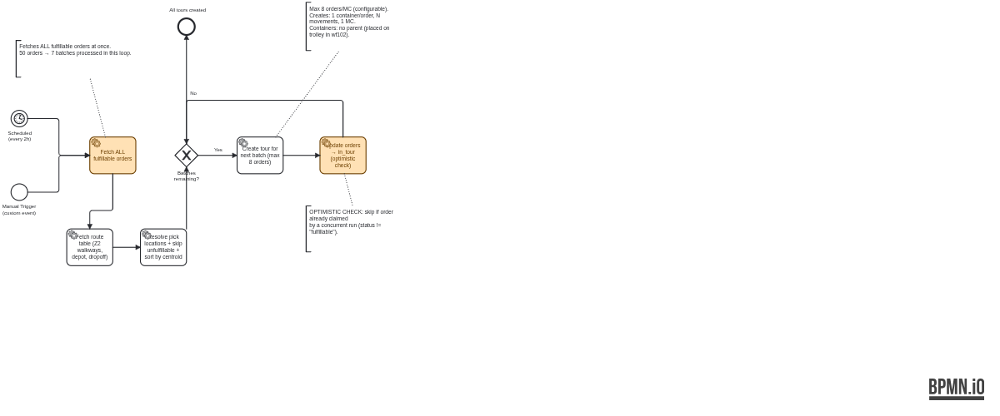
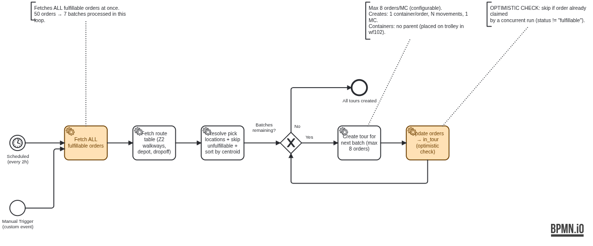

# bpmnfmt

gofmt for BPMN. Lints process models for logical errors and rewrites the
diagram section (BPMN DI) with a canonical, human-readable layout. The
process logic is never touched — only how it looks.

**Before** — as modeled by hand:



**After** — `bpmnfmt -w tour-creation.bpmn`:



One straight line of work, left to right. The batch loop reads forward on
the spine, its way-back line runs below, the exit rises to the end event.
Deterministic and idempotent: the same model always renders the same
diagram, and formatting a formatted file changes nothing.

## Install

```
go install github.com/pyck-ai/bpmnfmt/cmd/bpmnfmt@latest
```

## Usage

```
bpmnfmt file.bpmn            # formatted file to stdout (or stdin -> stdout)
bpmnfmt -w *.bpmn            # rewrite files in place
bpmnfmt -l *.bpmn            # list files whose layout differs (CI)
bpmnfmt -d file.bpmn         # unified diff
bpmnfmt -check *.bpmn        # lint only, write nothing
```

Flags:

| Flag | Effect |
|------|--------|
| `-json` | print findings as JSON |
| `-fail-on error\|warning\|info` | severity threshold for exit code 1 (default `error`) |
| `-force` | format even when lint reports errors |
| `-happy-end ID` | end event the happy path must reach |
| `-happy-flow ID,ID` | sequence flows preferred at gateway splits |
| `-version` | print version and exit |

Exit codes: `0` clean · `1` findings above threshold / differences found ·
`2` usage or parse error.

## What it guarantees

Only the `<bpmndi:BPMNDiagram>` element is replaced. Every other byte —
XML comments, attribute order, documentation, whitespace — survives
untouched. Shape colors (`bioc:`/`color:`) are carried over. Output is
deterministic and idempotent.

The layouter validates its own output on every run: no overlapping
shapes, no edge through a shape, no leftward forward flows, a straight
spine, and zero forbidden edge crossings.

## Layout rules

1. **Happy path on one row, left to right.** The spine is chosen per
   split, in order of precedence: flows named by `-happy-flow` /
   `-happy-end`; the branch that feeds a loop back to this gateway (loops
   read forward, see rule 3); the branch that reaches an end event; the
   first-declared flow. Overrides apply to the top-level process only —
   they are silently ignored inside expanded sub-processes. Off the spine,
   a chain continues into the successor that links back into already-placed
   work, so cross-linked nodes stay on an adjacent row instead of being
   buried and routed around the diagram.
2. **Grid.** Node centers snap to a 160px column grid and shared row
   centerlines — elements line up horizontally and vertically.
3. **Loops read forward.** At a gateway that a loop returns to, the loop
   body *is* the main line: it continues straight through the diamond, the
   way-back line returns below, and the loop's exit rises out of the top
   corner. The work stays on one row; leaving the loop is the detour.
   A branch whose only exit is a back edge upstream on its own chain, with
   no sub-branches, is laid out right to left instead — head under the
   split, tail under the loop target — provided marching left at natural
   spacing fills that span exactly. Such a branch is its own way-back line.
4. **Branches use the gateway's corners.** A spine gateway with exactly
   three outgoing flows uses all three corners of the diamond: the happy
   path runs straight through, the shorter alternate leaves the top
   corner, the longer the bottom (a branch that loops back never goes up).
   With four or more outgoing flows the top corner stays unused and every
   alternate hangs below, stacked longest-first. Entry edges drop in the
   gateway's own column and turn once into the branch head's left side;
   branch heads align with the column of the first non-gateway node after
   the split, so a run of consecutive gateways shares one branch-head
   column. Gateways inside a branch always stack their alternates below.
   A branch is routed above the spine only when its whole subtree is
   terminal — one that re-merges downstream hangs below, however short.
5. **Rejoins turn in the target's column.** Branch tails whose last node is
   a gateway or event align under their merge target and rise vertically
   into its bottom edge. An activity tail stops one column short, leaves to
   the right, and turns up in the target's column — a rectangle is left
   through its right border, never its top. Secondary-start inflows rejoin
   the same way.
6. **Way-back lines.** Every back edge leaves its source's bottom, drops
   to a dedicated horizontal line directly below the lower of the two
   rows, runs backward, and rises into the target's bottom — unless the
   source sits directly below the target in the same column, in which case
   the way-back line has zero length and the edge rises straight up.
   Crossings are allowed on these lines (and only there); multiple loops
   get stacked lines, wider ones nesting outside narrower ones. Rejoins
   that share a target also share one lane, so several arcs read as a
   single line with short risers peeling off it.
7. **Orthogonal edges, few bends.** Dockings spread out per node side, and
   edges arriving at a gateway land on the diamond's slanted face at their
   own offset — arrowheads never pile onto one point. A vertical corridor
   is reserved per column *and* row band, so two verticals may share a
   column when the rows they cross do not overlap.
8. **Annotations.** Short notes sit in a band directly above their anchor;
   prose notes are parked above or below the diagram with a short, clear
   association line.

## Lint rules

| Rule | Severity | Meaning |
|------|----------|---------|
| E1 | error | dangling refs / inconsistent incoming-outgoing declarations |
| E2 | error | duplicate IDs |
| E3 | error | start event with incoming / end event with outgoing flow |
| E4 | error | node not wired in (missing incoming or outgoing flow) |
| E5 | error | unreachable from start / no path to an end event |
| E7 | error | unsupported construct (pools, lanes, collapsed/nested subprocesses, boundary events, parallel gateways, multiple processes) |
| W1 | warning | implicit split: activity with >1 outgoing flow |
| W2 | warning | unlabeled branch out of a decision gateway |
| W3 | warning | unnamed decision gateway |
| W4 | warning | gateway that both merges and splits |
| W5 | warning | disconnected flows in one process |
| W6/W7 | warning | missing / orphaned diagram elements |
| I1–I3 | info | implicit merge, no-op gateway, multiple start events |

Lint errors block formatting (`-force` overrides).

## Use as a library

The module root exposes a stable embedding API (e.g. for a `pyck bpmn fmt`
subcommand); the `internal/` packages are implementation detail.

```go
import "github.com/pyck-ai/bpmnfmt"

src, _ := os.ReadFile("flow.bpmn")

findings, err := bpmnfmt.Check(src, "flow.bpmn")          // lint only

res, err := bpmnfmt.Format(src, "flow.bpmn", bpmnfmt.Options{})
if res.Formatted {                                        // false on lint errors
    _ = os.WriteFile("flow.bpmn", res.Output, 0o644)
}
```

`Options` mirrors the CLI: `Force`, `HappyEnd`, `HappyFlows`. `Result`
carries `Findings` (always populated), `Output`, and `Formatted`.

## Scope

Targets straight-through process models: events (plain, timer, signal,
message), tasks of all types, exclusive gateways, text annotations, and
**expanded embedded sub-processes** — the interior is laid out recursively
inside the container rectangle (one level deep; multi-instance markers are
preserved). Collapsed sub-processes, sub-processes nested more than one
level, collaborations (pools/lanes), boundary events and parallel/inclusive
gateways are detected and rejected with E7.

## Development

```
go test ./...                                       # layout invariants + goldens
go test ./internal/format -run TestGolden -update   # refresh golden files
python3 -m http.server 8077                         # then open hack/viewer/?f=testdata/x.bpmn
```

The files under `testdata/` are anonymized real-world fixtures;
`testdata/golden/` pins their formatted output byte for byte. Every layout
rule above has a discriminating fixture that fails if the rule regresses.
